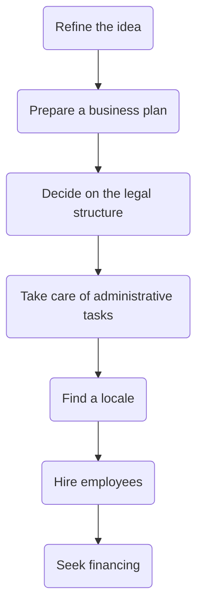

# Steps to create a new business

## Why do it?

- New business idea.
- Passion to make change.
- Market need.
- Earning a living.
- Financial reward.
- Control.
- Life-work balance.

## Challenges

- Lack of funds.
- Strong competition.
- Unskilled labor or lack of collaboration.
- Market too small.
    - Or no market at all.
- Poor management skills.
- Economic, environmental or political shocks.

# Business success

Success or failure depends on changes in the [[STEEPLE analysis]] conditions, and in other aspects:

1. There is a skilled and collaborative team of employees in place.
2. There is enough funding to run the business.
3. The marketing has been researched well.
4. The operations are efficient and resilient.

# Entrepreneurial & Intrapreneurial

## Entrepreneurial

![[Entrepreneurship]]

## Intrapreneurial

![[Intrapreneurship]]