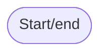
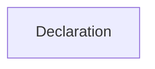
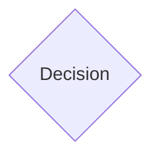
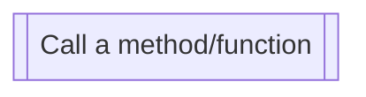

A flowchart is used to diagrammatically describe an [[Algorithm]]. The following symbols are widely accepted:

# Start/end

To mark the start and end of an algorithm.

> [!important] Despite having a finite number of steps, it may not always end anyway.

# Declaration/assignment

Declare a variable.

# Decision

Can be used for:

- If
- While
- For

# Call a method/function

Use a method or a function. Can receive input, in the same box.

