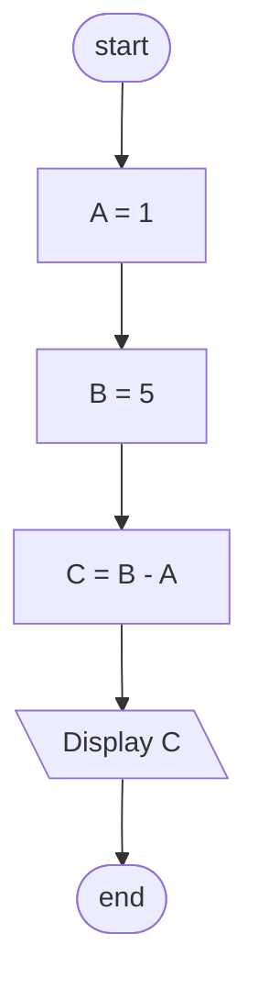
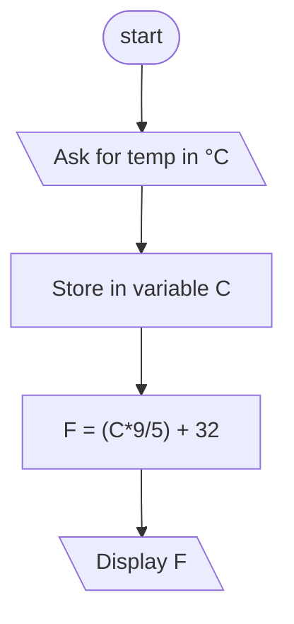
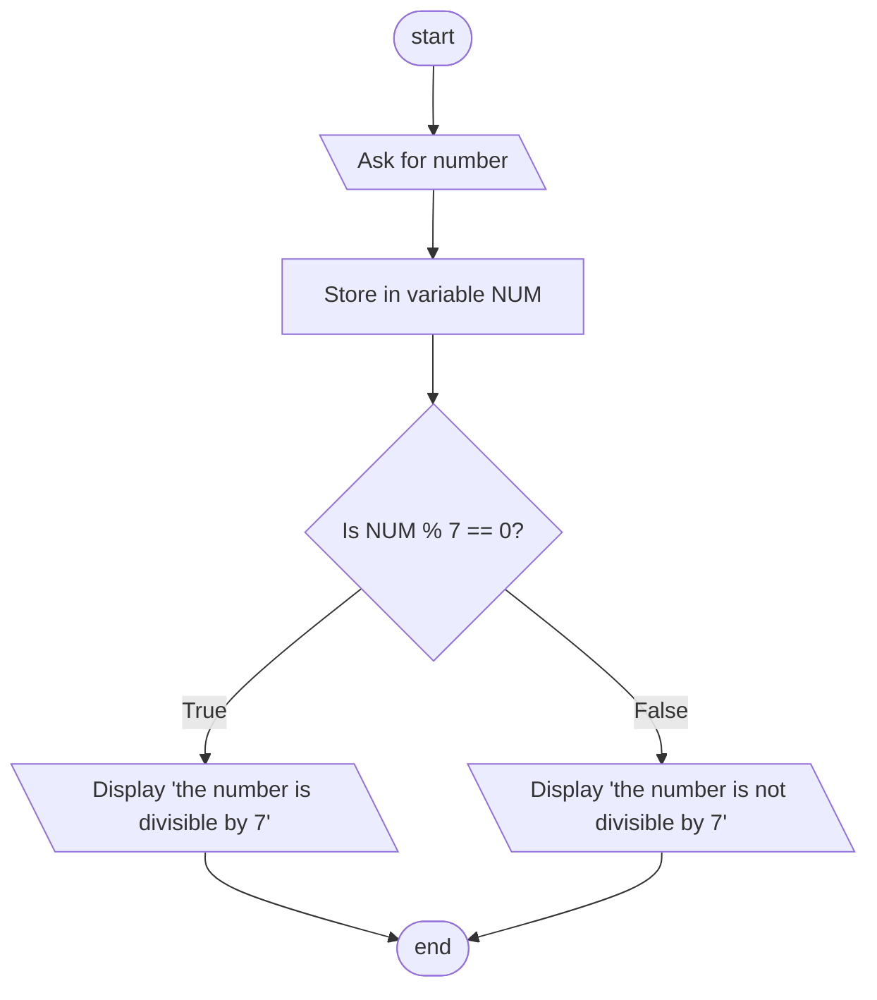
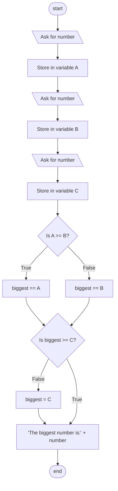
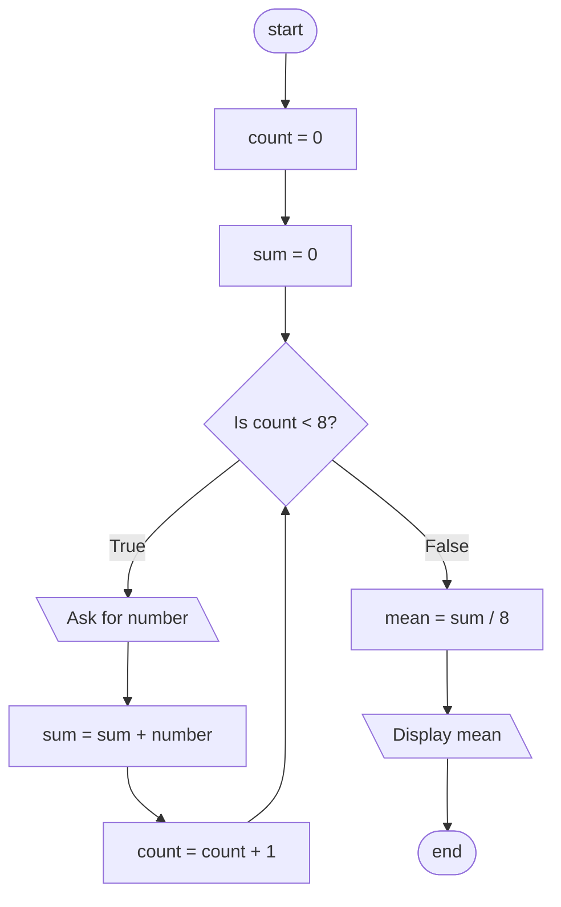
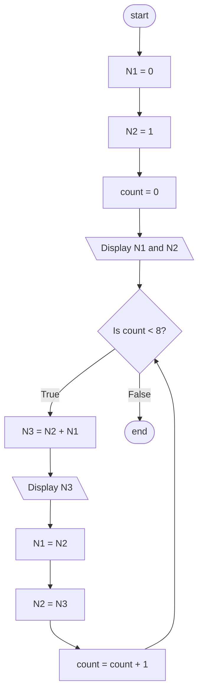
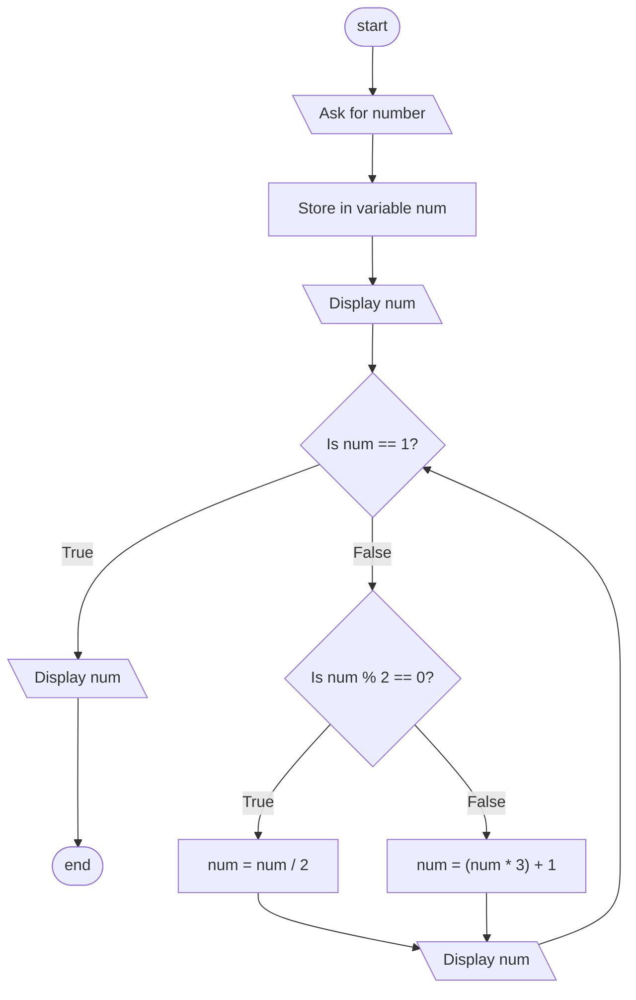

# Part 1 - Decisions and ifs

- Declare variables A and B, subtract A from B and display the result.

- Ask the user for a temperature in °C, convert it to °F using the formula F=(C×9/5)+32 and display the result.

- Determine if a number is divisible by 7, when the number is divisible show on screen “the number is divisible by 7”, otherwise display on screen “the number is not divisible by 7”.

- Ask the user for 3 numbers, determine which one is the biggest number and print “the biggest number is: ” + number

# Part 2 - Cycles

- Ask the user for 8 numbers and display the mean of those numbers. Use a cycle.

- Display the first 10 numbers of the fibonacci sequence.

- Ask the user for a number and print all the collatz conjecture series.

