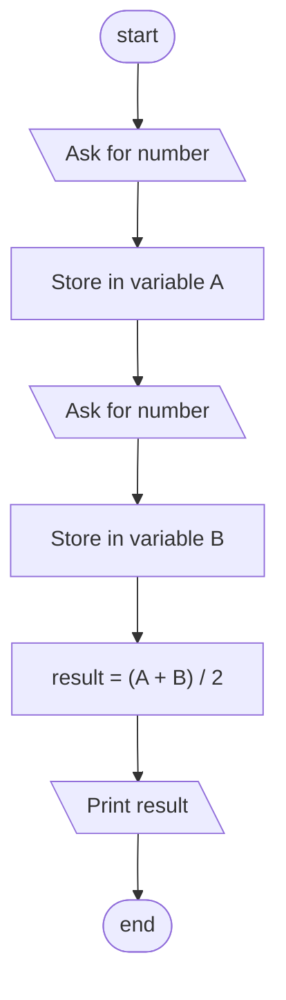
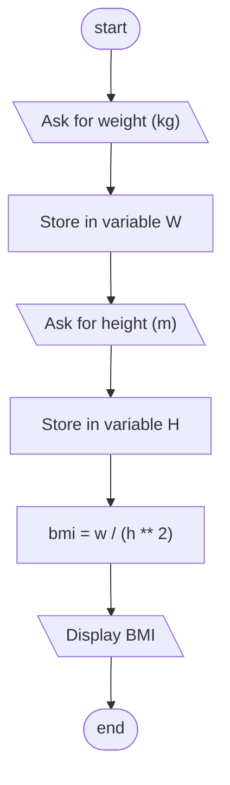
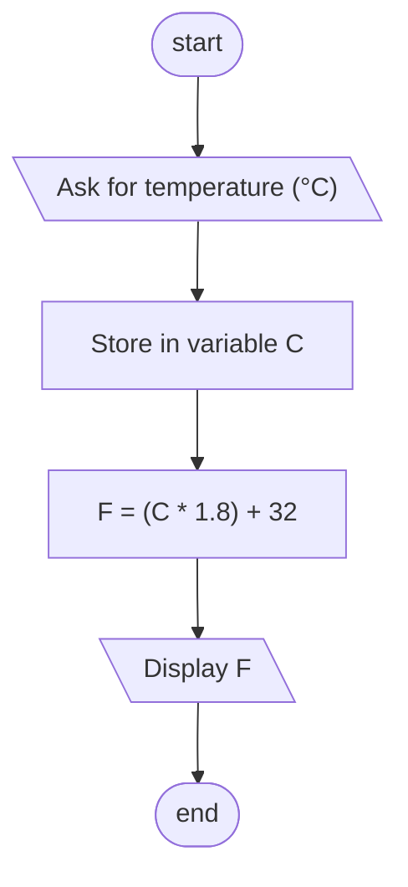
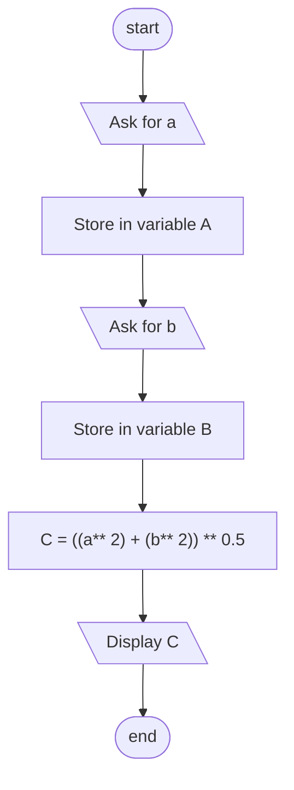
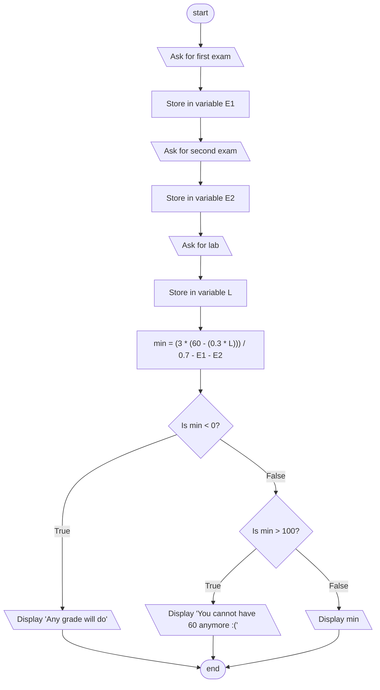

- Write a program that asks for two numbers and shows their arithmetic mean.

- Write a program that asks for the weight (in kilograms) and height (in meters) of a person and calculates their body mass index (BMI), to one decimal place.

- Write a program that asks for temperature in Celsius and prints that temperature in Fahrenheit.

- Write a program that receives as input the lengths of the two legs of a right triangle $a$ and $b$, and that outputs the length of the hypotenuse $c$, given by the Pythagorean theorem: $c^2 = a^2 + b^2$.

A student wants to know what grade he needs in the third exam to pass a subject. The 3 exams are average using the following formula, where $E_1$, $E_2$ and $E_3$ are the 3 grades of the exams.

$$
  G_E = \frac{E_1 E_2 E_3}{3}
$$

The final grade is calculated with the following formula, where $G_E$ is the exams average and $L$ is the lab grade.

$$
F=0.7G_E + 0.3L
$$

Write a program that asks the user for the grades of the first two exam grades and lab grade, and print the grade that the student needs to pass the class with a final grade of 60.

