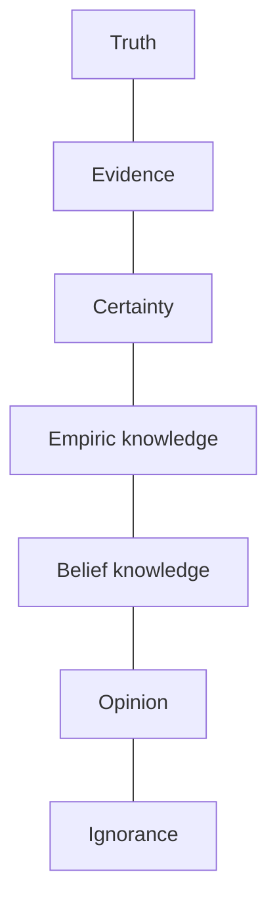

# Development of knowledge

The knowledge that we value most, and the ones we value less.

- Scientific
- Metaphysical
- Theological

# Development of thought

The thought that has advanced more, and the ones that has been left behind.

- Scientific
- Religious
- Magical

# Gradient of truth

